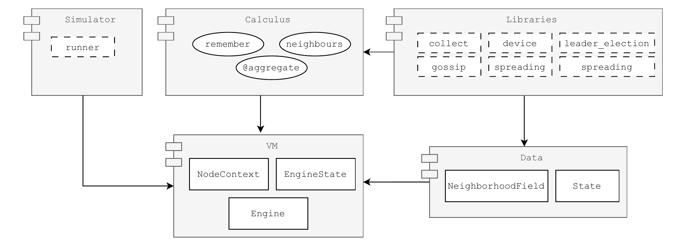
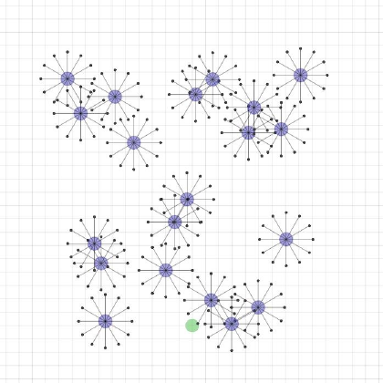
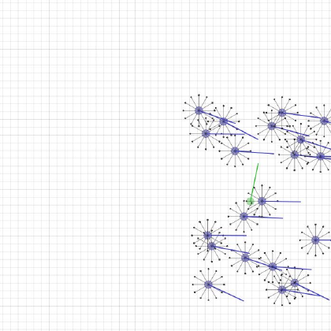

<div class="cover-center-shell">
  <div class="cover-logo-wrap">
    <PhyeldsLogo />
  </div>

  <h2 class="cover-subtitle">A Pythonic Framework for Aggregate Computing</h2>


  <div class="cover-meta-row">
    <div class="cover-mini-meta"><strong style="color: var(--deck-orange);">Gianluca Aguzzi</strong> · Davide Domini · Nicolas Farabegoli · Mirko Viroli</div>
    <div class="cover-mini-meta">University of Bologna</div>
  </div>

  <p class="cover-kicker">COORDINATION 2026 · Urbino · 11 June 2026</p>

  <div class="cover-qr-row" style="display: flex; gap: 1.5rem; align-items: center; justify-content: center; margin-top: -2.5rem;">
    <QrCard title="Repository" url="https://github.com/phyelds/phyelds" short="github.com/.../phyelds" style="transform: scale(0.65);" />
    <QrCard title="Binder Demo" url="https://mybinder.org/v2/gh/phyelds/phyelds-examples/HEAD?urlpath=%2Fdoc%2Ftree%2F%2Fbinder%2Fphyelds-example.ipynb" short="Interactive demo" style="transform: scale(0.65);" />
  </div>
  
</div>

---
layout: default
class: stage-slide
---

<div class="slide-shell">

# Why coordinating large networks is still hard?

<v-clicks>

- Engineering <span class="u-solid-teal">emergent global behavior</span> from purely local interactions is notoriously challenging.
  - Nodes rely on peer-to-peer contact, execute asynchronously, and lack a global view.
- Consequently, large-scale networks are inherently characterized by strict <span class="mark-orange">locality</span>, <span class="mark-teal">asynchrony</span>, and <span class="mark-green">partial information</span>.
- Traditional, device-centric programming conflates <span class="mark-teal">high-level collective logic</span> with low-level details like message passing and state synchronization.
- As networks scale, <span class="u-solid-orange">reasoning about global system state</span> becomes an engineering bottleneck.

</v-clicks>

<div class="three-up">
  <div class="soft-card" v-click>
    <div class="card-title">Target Scenarios</div>
    <div class="card-text">Sensor networks, edge-cloud systems, robot swarms, federated learning deployments.</div>
  </div>
  <div class="soft-card" v-click>
    <div class="card-title">The engineering tax</div>
    <div class="card-text">Coordination logic leaks <span class="mark-orange">everywhere</span>, so collective behavior is hard to express and maintain.</div>
  </div>
  <div class="soft-card accent-card" v-click>
    <div class="card-title">Needed abstraction</div>
    <div class="card-text">Describe the <span class="u-solid-teal">collective behavior</span>, keep local execution underneath.</div>
  </div>
</div>


</div>

---
layout: default
class: stage-slide
---

<div class="slide-shell">

# Aggregate Computing
## A macroprogramming top-down vision

<div class="visual-box visual-box-wide" style="margin: 0.2rem auto 0.6rem;">
  <AggregateFlow />
</div>

<v-clicks>

- The program specifies an <span class="u-solid-teal">evolving computational field</span>.<sup class="cite">[1,3]</sup>
  - This is a dynamic, distributed data structure that emerges from local interactions to represent the global system state.
- Individual devices execute the code locally, keeping execution decentralized.
- This macro-abstraction enables developers to reason <span class="mark-teal">globally</span> about behaviors emerging from local actions.

</v-clicks>

<div class="comparison-grid">
  <div class="comparison-card" v-click>
    <div class="card-title">Device-centric view</div>
    <div class="card-text">How should node <span class="mono">i</span> manage its local state and messages?</div>
  </div>
  <div class="comparison-card" v-click>
    <div class="card-title">Aggregate view</div>
    <div class="card-text">How can computational fields be composed into a coherent <span class="u-solid-teal">collective behavior</span>?</div>
  </div>
  <div class="comparison-card highlight" v-click>
    <div class="card-title">Result</div>
    <div class="card-text">Drastically simplified coordination logic and direct alignment with <span class="mark-orange">system-wide intent</span>.</div>
  </div>
</div>

</div>

---
layout: default
class: viz-slide
---

<div class="slide-shell">

# Self-organizing-like local rounds

<div class="split-grid">

<div>

<ul>
  <li><strong>Each round consists of three repeated phases:</strong>
    <ul>
      <li v-click="1">
        <strong style="color: var(--deck-orange);">1. Sense</strong> — collect sensor inputs & incoming neighbor messages.
      </li>
      <li v-click="2">
        <strong style="color: var(--deck-teal);">2. Compute</strong> — run local state evaluation logic to produce <span class="mark-teal">new state</span> and <span class="mark-green">outbound messages</span>.
      </li>
      <li v-click="3">
        <strong style="color: var(--deck-green);">3. Interact / Act</strong> — share results & interact with physical neighbors.
      </li>
    </ul>
  </li>
  <li v-click="4">Rounds are <span class="u-solid-orange">asynchronous</span>: there is no global lock-step.</li>
</ul>

</div>

<div class="visual-box">
  <LocalRoundLoop :click="$clicks" />
</div>
</div>
</div>

---
layout: default
class: viz-slide
---

<div class="slide-shell">

# Fields emerge through repetition

<v-clicks>

- Expressing a <span class="u-solid-teal">global coordination intent</span> over a static network topology...
- ...triggers a local, self-organizing <span class="mark-orange">transient propagation phase</span>...
- ...which quickly converges and stabilizes into the <span class="mark-green">desired global result</span>.

</v-clicks>

<div class="visual-box visual-box-wide">
  <FieldEvolution />
</div>

</div>

---
layout: default
class: stage-slide
---

<div class="slide-shell">

# The Gap
## Aggregate computing is a natural fit for distributed ML...

<v-clicks>

- The synergy is <span class="u-solid-teal">bidirectional</span>:
  - Aggregate computing enables scalable <span class="mark-teal">distributed learning</span> — federated learning and multi-agent RL.
  - Machine learning enables <span class="mark-orange">data-driven adaptation</span> inside aggregate programs.
- Coordination is exactly the hard part in <span class="mark-teal">RL / MARL</span> and <span class="mark-green">federated</span> settings — where aggregate computing shines.

</v-clicks>

<div class="three-up">
  <div class="soft-card" v-click>
    <div class="card-title">Mature AC ecosystems</div>
    <div class="card-text">Protelis, ScaFi, and FCPP prove the paradigm works — but they are <span class="mark-orange">JVM / C++</span> centric.</div>
  </div>
  <div class="soft-card" v-click>
    <div class="card-title">ML lives in Python</div>
    <div class="card-text">AI/ML practitioners and roboticists work in <span class="mark-teal">Python</span>, not in JVM languages.</div>
  </div>
  <div class="soft-card accent-card" v-click>
    <div class="card-title">Today's tools don't help</div>
    <div class="card-text">Without native field calculus in Python, the two communities stay <span class="u-solid-orange">apart</span>.</div>
  </div>
</div>

</div>

---
layout: default
class: stage-slide
---

<div class="slide-shell">

# Bridging the Gap
## ...so we bring field calculus natively into Python — <span class="mark-orange">Phyelds</span>

<div class="three-up" style="margin-top: 1rem;">
  <div class="soft-card" v-click>
    <div class="card-title">Pythonic API</div>
    <div class="card-text">Coordination logic looks like standard, idiomatic Python instead of a functional DSL.</div>
  </div>
  <div class="soft-card" v-click>
    <div class="card-title">Lightweight Core</div>
    <div class="card-text">A micro-runtime built with modular, reusable, and highly extensible internals.</div>
  </div>
  <div class="soft-card accent-card" v-click>
    <div class="card-title">Integration-First</div>
    <div class="card-text">Designed to connect with <span class="mark-teal">ML libraries</span>, <span class="mark-orange">notebooks</span>, and <span class="mark-green">simulators</span>.</div>
  </div>
</div>

<div class="value-strip" style="margin-top: 1.2rem; padding: 0.6rem 0.9rem; text-align: center;" v-click>
  <span class="value-label">Target ecosystem:</span>
  <span class="mark-teal" style="font-weight: 600; margin-right: 0.8rem;">PyTorch & JAX</span>
  <span class="mark-orange" style="font-weight: 600; margin-right: 0.8rem;">Jupyter</span>
  <span class="mark-green" style="font-weight: 600;">VMAS & Mujoco</span>
</div>

</div>


---
layout: default
class: stage-slide
clicks: 2
---

<div class="slide-shell">

# Architecture at a glance


<ArchitectureOverview :click="$clicks" />

</div>

---
layout: default
class: code-slide
---

<div class="slide-shell">

# Core API 1: the engine loop

```python {all|3-7|8|9|all}
from phyelds import engine

engine.get().setup(
    node_context=node_ctx,
    messages=received_messages,
    state=previous_state,
)
result = my_aggregate_program()
new_state, outbound = engine.get().cooldown()
```

<div class="three-up">
  <div class="soft-card" v-click="1">
    <div class="card-title">Setup</div>
    <div class="card-text"><code class="mono mark-teal">setup</code> injects local context, inbound messages, and previous state.</div>
  </div>
  <div class="soft-card" v-click="2">
    <div class="card-title">Run</div>
    <div class="card-text">The aggregate program runs as plain Python in the active VM.</div>
  </div>
  <div class="soft-card" v-click="3">
    <div class="card-title">Cooldown</div>
    <div class="card-text"><code class="mono mark-orange">cooldown</code> returns the new state and outbound messages.</div>
  </div>
</div>


</div>

---
layout: default
class: code-slide
---

<div class="slide-shell">

# Core API 2: remember and neighbors

<div class="section-lead">
  Two primitives cover local state and neighbor exchange.
</div>

<div class="split-grid" style="grid-template-columns: 1fr 1fr; align-items: start; gap: 1.5rem; margin-top: 0.2rem;">

<div>

```python {all|3|4|all}
@aggregate
def counter():
    set_value, value = remember(0)
    set_value(value + 1)
    return value
```

<div class="code-caption" style="margin-top: 0.5rem;">
  <code class="mono mark-teal">remember</code> is the Pythonic face of <span class="mono">rep</span>.
</div>
</div>

<div v-click="4">

```python {all|3|4|all}
@aggregate
def spread(my_value):
    nbr_values = neighbors(my_value)
    return max(nbr_values.values())
```

<div class="code-caption" style="margin-top: 0.5rem;">
  <code class="mono mark-orange">neighbors</code> returns an aligned neighborhood field that behaves like a Python object.
</div>
</div>

</div>

</div>

---
layout: default
class: stage-slide
---

<div class="slide-shell">

# Core API 3: small core, rich building blocks

<div class="three-up" style="margin-top: 1.2rem; gap: 1.2rem;">
  <div class="soft-card" v-click style="padding: 1rem 1.1rem; min-height: 11rem;">
    <div class="card-title" style="color: var(--deck-teal); font-weight: 600; border-bottom: 2px solid var(--deck-teal-soft); padding-bottom: 0.35rem; margin-bottom: 0.8rem; font-size: 1.05rem; letter-spacing: 0.01em;">Spatiotemporal Tracking</div>
    <div class="card-text" style="font-size: 0.85rem; line-height: 1.5; color: var(--deck-muted);">
      <ul style="padding-left: 1.1rem; margin: 0;">
        <li>Track positions & distances</li>
        <li>Align local clocks & rounds</li>
        <li>Ground logic in physical space</li>
      </ul>
    </div>
  </div>
  
  <div class="soft-card" v-click style="padding: 1rem 1.1rem; min-height: 11rem;">
    <div class="card-title" style="color: var(--deck-orange); font-weight: 600; border-bottom: 2px solid var(--deck-orange-soft); padding-bottom: 0.35rem; margin-bottom: 0.8rem; font-size: 1.05rem; letter-spacing: 0.01em;">Spread & Aggregation</div>
    <div class="card-text" style="font-size: 0.85rem; line-height: 1.5; color: var(--deck-muted);">
      <ul style="padding-left: 1.1rem; margin: 0;">
        <li>Disseminate info network-wide</li>
        <li>Aggregate local edge data</li>
        <li>Drive spatial feedback loops</li>
      </ul>
    </div>
  </div>
  
  <div class="soft-card accent-card" v-click style="border-color: rgba(47, 107, 91, 0.35); background: rgba(47, 107, 91, 0.04); padding: 1rem 1.1rem; min-height: 11rem;">
    <div class="card-title" style="color: var(--deck-green); font-weight: 600; border-bottom: 2px solid rgba(47, 107, 91, 0.15); padding-bottom: 0.35rem; margin-bottom: 0.8rem; font-size: 1.05rem; letter-spacing: 0.01em;">Regional Organization</div>
    <div class="card-text" style="font-size: 0.85rem; line-height: 1.5; color: var(--deck-muted);">
      <ul style="padding-left: 1.1rem; margin: 0;">
        <li>Elect leaders dynamically</li>
        <li>Partition swarms into cells</li>
        <li>Coordinate regional learning</li>
      </ul>
    </div>
  </div>
</div>

<div class="value-strip" v-click style="margin-top: 1.8rem; padding: 0.75rem 1.1rem;">
  <div>
    <span class="value-label">High-Level Composition:</span>
    These primitives serve as building blocks for <span class="u-solid-orange">complex coordination</span>, from decentralized <span class="mark-teal">federated learning</span> to cohesive <span class="mark-green">swarm flocking</span>.
  </div>
</div>

</div>

---
layout: default
class: stage-slide
---

<div class="slide-shell">

# Channel: from source to target

<div class="split-grid" style="grid-template-columns: 1.1fr 0.9fr; gap: 1.5rem; align-items: center; margin-top: 0.5rem;">

<div>

<v-clicks>

- **Goal:** Establish a robust communication pipeline between a <span class="mark-green">source</span> ($S$) and a <span class="mark-orange">target</span> ($T$).
- Composes simple building blocks:<sup class="cite">[2,5]</sup>
  - Local geometric views (<span class="mark-teal">neighbor distances</span>)
  - Target-rooted <span class="u-solid-orange">distance gradient</span>
  - Shortest path <span class="mark-teal">routing</span>
  - Spatial thresholding to <span class="mark-teal">adjust width</span>
- **Self-Stabilizing:** Dynamically adapts to <span class="mark-orange">node failures</span>, <span class="mark-teal">message loss</span>, and <span class="mark-green">physical movement</span>.
- **Redundancy:** Width parameter enables <span class="mark-teal">multipath routing</span> to overcome local communication gaps.

</v-clicks>

</div>

<div style="text-align: center;">
  <div class="visual-box" style="padding: 0.5rem;">
    <ChannelEvolution />
  </div>
</div>

</div>

</div>

---
layout: default
class: viz-slide
---

<div class="slide-shell">

# Channel: step-by-step construction

<div class="split-grid" style="grid-template-columns: 520px 1fr; gap: 1.5rem; align-items: start; margin-top: 0.2rem;">

<div style="font-size: 0.63rem; width: 520px; overflow: hidden; display: flex; flex-direction: column;">

```python {all|3|4|5|6-10|11-13|all}
@aggregate
def main(width):
    distances = neighbors_distances()
    d_source = distance_to(sense("source"), distances)
    d_target = distance_to(sense("target"), distances)
    d_target_source = broadcast(
        sense("target"), 
        d_source, 
        distances
    )
    channel = 1.0 if 
        d_source + d_target <= d_target_source + width 
        else 0.0
    return channel
```

<div class="code-caption" style="margin-top: 0.5rem; font-size: 0.76rem; line-height: 1.45;">
  <span v-if="$clicks <= 1">
    <strong style="color: var(--deck-teal);">endpoints</strong> — Build local geometric view with neighbor distances.
  </span>
  <span v-else-if="$clicks === 2">
    <strong style="color: var(--deck-teal);">source gradient</strong> — Compute distance field from source <code class="mono">S</code>.
  </span>
  <span v-else-if="$clicks === 3">
    <strong style="color: var(--deck-orange);">target gradient</strong> — Compute distance field from target <code class="mono">T</code>.
  </span>
  <span v-else-if="$clicks === 4">
    <strong style="color: var(--deck-orange);">distance S-T</strong> — Share source distance from target to obtain <code class="mono">d(S,T)</code>.
  </span>
  <span v-else>
    <strong style="color: var(--deck-green);">channel</strong> — Check inequality: <code class="mono">d_source + d_target &le; d_target_source + width</code>.
  </span>
</div>

</div>

<div style="text-align: center;">
  <div class="visual-box" style="margin-bottom: 0.5rem;">
    <ChannelEvolution :click="$clicks" />
  </div>
</div>

</div>

</div>

---
layout: default
class: code-slide
---

<div class="slide-shell">

# Distributed Federated Learning via Phyelds<sup class="cite">[7,8,9]</sup>

```python {all|3-4|5|6|7-8|9-10|11|all}
@aggregate
def client(initial_model_params):
    set_value, value = remember((initial_model_params, 0))
    local_model, tick = value
    evolved_model, _ = local_training(local_model, training_data)
    distances = loss_based_distances(evolved_model, validation_data)
    leader = elect_leaders(threshold, distances)
    potential = distance_to(leader, distances)
    models = collect_with(potential, [evolved_model], lambda x, y: x + y)
    area_model = broadcast(leader, average_weights(models), distances)
    set_value((area_model, tick + 1))
```

<div class="code-caption" style="margin-top: 0.55rem; font-size: 0.76rem; line-height: 1.45; min-height: 2.8rem;">
  <span v-if="$clicks === 0">
    <strong style="color: var(--deck-teal);">high-level view</strong> — Self-Organizing Federated Learning (SOFL) maps data similarities to physical and logical coordinates.
  </span>
  <span v-else-if="$clicks === 1">
    <strong style="color: var(--deck-teal);">state persistence</strong> — (field of models) Devices remember their local training parameters overtime.
  </span>
  <span v-else-if="$clicks === 2">
    <strong style="color: var(--deck-orange);">local training</strong> — Each node performs standard local learning using its private on-board dataset.
  </span>
  <span v-else-if="$clicks === 3">
    <strong style="color: var(--deck-teal);">relationship mapping</strong> — Similarity distances are derived dynamically based on local and neighbor validation loss.
  </span>
  <span v-else-if="$clicks === 4">
    <strong style="color: var(--deck-green);">regional clustering</strong> — Dynamic regional leaders are elected to form using similarity computed via local models,;
    <strong style="color: var(--deck-green);">aggregation & sharing</strong> — Model weights are collected up the regional tree, averaged, and broadcasted back to update the cluster.
  </span>
  <span v-else>
    <strong style="color: var(--deck-orange);">state update</strong> — The aggregated model parameters are sent back to each device, incorporating regioanl-wise knowledge.
  </span>
</div>

</div>

---
layout: default
class: viz-slide
---

<div class="slide-shell">

# VMAS: aggregate coordination in differentiable simulators

<v-clicks>

- Phyelds <span class="u-solid-orange">adapts to external environments</span> — opening the pathway to simulators in other domains (traffic, ecology, social systems).
- VMAS (Vectorized Multi-Agent Simulator)<sup class="cite">[11]</sup> is a differentiable multi-agent simulator; we <span class="mark-teal">embed aggregate computing</span> by implementing the engine loop and primitives on top of its API.
- Integration splits between a <span class="mark-teal">runner</span> and an <span class="mark-teal">environment wrapper</span> — bringing aggregate coordination into <span class="mark-teal">MARL</span> and <span class="mark-green">swarm</span> settings.

</v-clicks>

<div class="visual-box visual-box-wide">
  <FlockingStages />
</div>

</div>

---
layout: default
class: end-slide
transition: fade
---

<div class="slide-shell">

# Three takeaways

<div class="three-up compact">
  <div class="soft-card">
    <div class="card-title">Python-native aggregate computing</div>
    <div class="card-text">Lower barrier to entry for <span class="mark-teal">ML</span>, <span class="mark-orange">education</span>, and <span class="mark-green">robotics</span>.</div>
  </div>
  <div class="soft-card">
    <div class="card-title">Small core, rich composition</div>
    <div class="card-text">A compact calculus layer can support <span class="u-solid-orange">reusable coordination patterns</span>.</div>
  </div>
  <div class="soft-card accent-card">
    <div class="card-title">Integration matters</div>
    <div class="card-text">The value is not only the runtime, but how naturally it <span class="mark-green">plugs into existing Python ecosystems</span>.</div>
  </div>
</div>

<p class="closing-line">
  Next: <span class="mark-teal">scalability</span> · <span class="mark-orange">benchmarking</span> · <span class="mark-green">broader simulator support</span> · <span class="mark-teal">real deployments</span>
</p>

</div>

---
layout: default
class: end-slide
---

<div class="slide-shell">

<div class="thanks-grid">

<div class="thanks-left">
  <PhyeldsLogo style="max-width: 140px; max-height: 140px; margin-bottom: 0.2rem;"></PhyeldsLogo>
  <div class="thanks-title">Grazie!</div>
  <div class="thanks-subtitle">
    Python-Native Declarative Coordination for <br>
    Heterogeneous Multi-Agent Systems
  </div>
  <div class="thanks-qr-row">
    <QrCard title="Repository" url="https://github.com/phyelds/phyelds" />
    <QrCard title="Interactive demo" url="https://mybinder.org/v2/gh/phyelds/phyelds-examples/HEAD?urlpath=%2Fdoc%2Ftree%2F%2Fbinder%2Fphyelds-example.ipynb" />
  </div>
  <div class="thanks-details">
    <strong>Contact:</strong> phyelds@example.com · <strong>GitHub:</strong> phyelds/phyelds
  </div>
</div>

<div class="collage-container">
  <div class="collage-item collage-arch">
    
  </div>
  <div class="collage-item collage-gradient">
    <div class="collage-scale-wrapper">
      <FieldEvolution />
    </div>
  </div>
  <div class="collage-item collage-frame1">
    
  </div>
  <div class="collage-item collage-channel">
    <div class="collage-scale-wrapper">
      <ChannelEvolution />
    </div>
  </div>
  <div class="collage-item collage-frame885">
    
  </div>
</div>

</div>

</div>

---
layout: default
class: stage-slide
---

<div class="slide-shell">

# References

<div class="ref-grid">
  <ol class="ref-list">
    <li>J. Beal, D. Pianini, M. Viroli. <em>Aggregate Programming for the Internet of Things</em>. IEEE Computer, 2015.</li>
    <li>R. Casadei. <em>Macroprogramming: Concepts, State of the Art, and Opportunities</em>. ACM Comput. Surv., 2023.</li>
    <li>G. Audrito, M. Viroli, F. Damiani, D. Pianini, J. Beal. <em>A Higher-Order Calculus of Computational Fields</em>. ACM TOCL, 2019.</li>
    <li>D. Pianini, M. Viroli, J. Beal. <em>Protelis: Practical Aggregate Programming</em>. ACM SAC, 2015.</li>
    <li>R. Casadei, M. Viroli, G. Aguzzi, D. Pianini. <em>ScaFi: A Scala DSL &amp; Toolkit for Aggregate Programming</em>. SoftwareX, 2022.</li>
    <li>R. Casadei, D. Pianini, M. Viroli, A. Natali. <em>Self-organising Coordination Regions</em>. COORDINATION, 2019.</li>
  </ol>
  <ol class="ref-list" start="7">
    <li>Y. Mo, J. Beal, S. Dasgupta. <em>An Aggregate Computing Approach to Self-stabilizing Leader Election</em>. IEEE FAS*W, 2018.</li>
    <li>B. McMahan, E. Moore, D. Ramage, S. Hampson, B. Agüera y Arcas. <em>Communication-Efficient Learning of Deep Networks from Decentralized Data</em>. AISTATS, 2017.</li>
    <li>D. Domini, G. Aguzzi, L. Esterle, M. Viroli. <em>FBFL: A Field-based Coordination Approach for Federated Learning</em>. LMCS, 2026.</li>
    <li>D. Domini, N. Farabegoli, G. Aguzzi, M. Viroli, L. Esterle. <em>Decentralized Proximity-aware Clustering for Collective Self-Federated Learning</em>. Internet of Things, 2026.</li>
    <li>M. Bettini, R. Kortvelesy, J. Blumenkamp, A. Prorok. <em>VMAS: A Vectorized Multi-Agent Simulator for Collective Robot Learning</em>. DARS, 2022.</li>
    <li>T. Vicsek, A. Czirók, E. Ben-Jacob, I. Cohen, O. Shochet. <em>Novel Type of Phase Transition in a System of Self-driven Particles</em>. Phys. Rev. Lett., 1995.</li>
  </ol>
</div>

</div>


